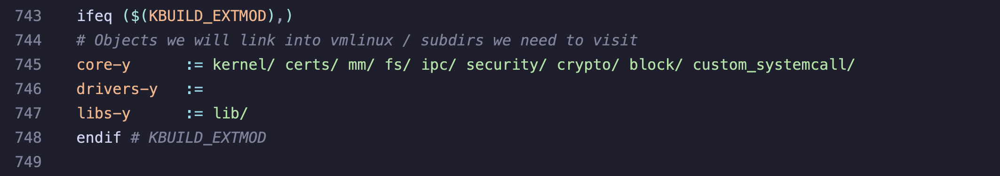
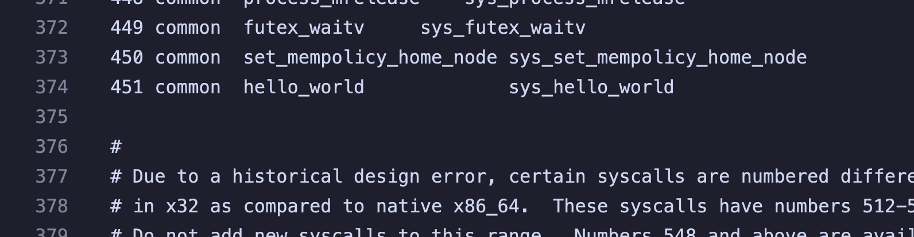
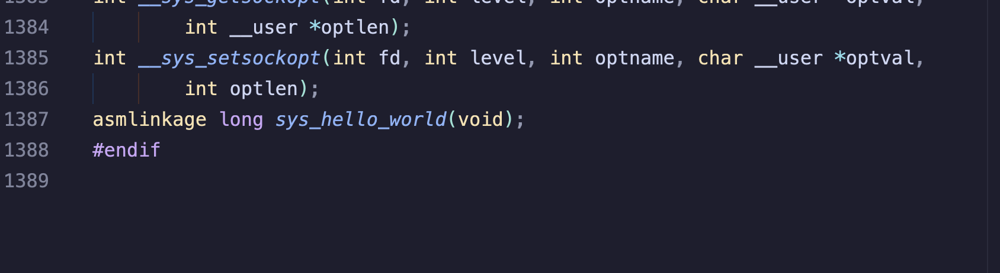

# Linux Systemcall Implementation

## How to Use?

1. execute script to setup environment and download kernel sources.

   ```shell
   sh bootsrap.sh
   ```

   - this script will also create link to related files under **src/**

2. add path to new systemcall in Makefile (already linked to src/Makefile)

   

   - add this to core-y

     ```shell
     core-y		:= kernel/ certs/ mm/ fs/ ipc/ security/ crypto/ block/ {{ folder to put new systemcall }}/
     # we put new systemcalls under custom_systemcall in kernel source
     core-y		:= kernel/ certs/ mm/ fs/ ipc/ security/ crypto/ block/ custom_systemcall/
     ```

3. add or edit new systemcall (include source files and Makefile) in **src/systemcall/**

   - you can check example systemcall (hello_world.c) under src/

4. add systemcall to syscall_64.tbl (already linked to src/syscall_64.tbl)

   

5. add systemcall to syscalls.h (already linked to src/syscalls.h)

   

   - add before the last #endif

6. run build.sh to compile and install the new kernel

   ```shell
   sh build.sh
   ```

7. (optional) if you use VM like lima vm, you cannot access grub entry during boot, remember to update the default kernel entry in /etc/default/grub then execute update-grub again

8. reboot the os with new kernel then test your code
